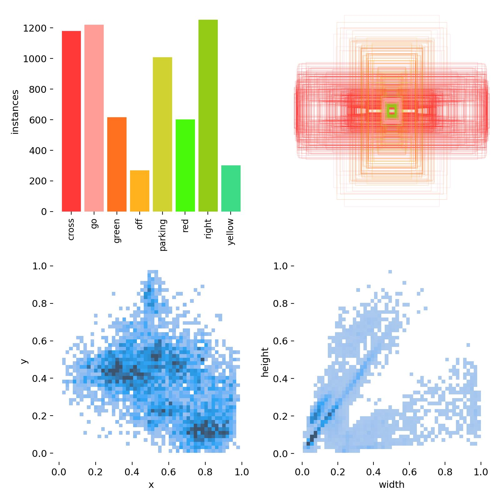
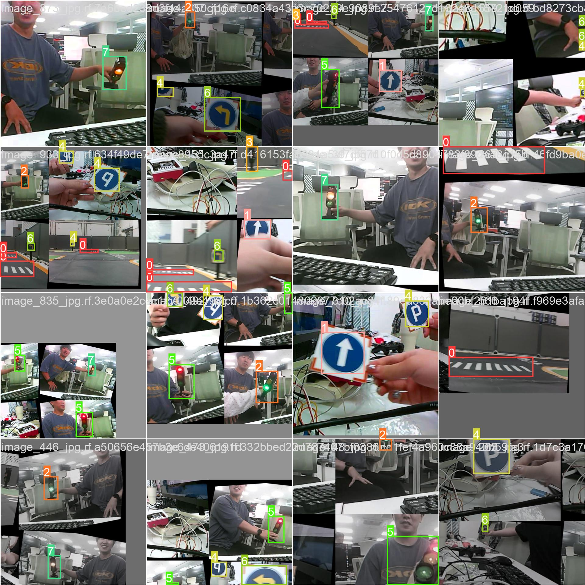
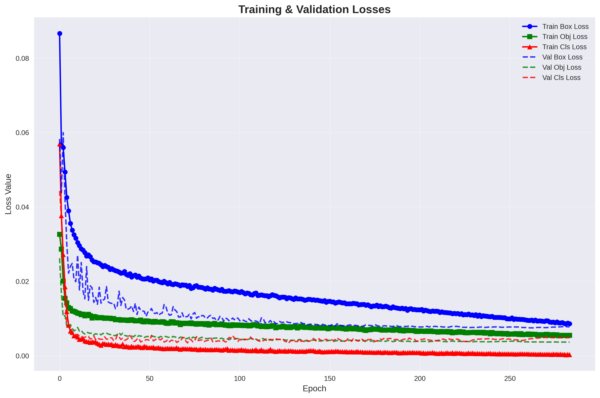
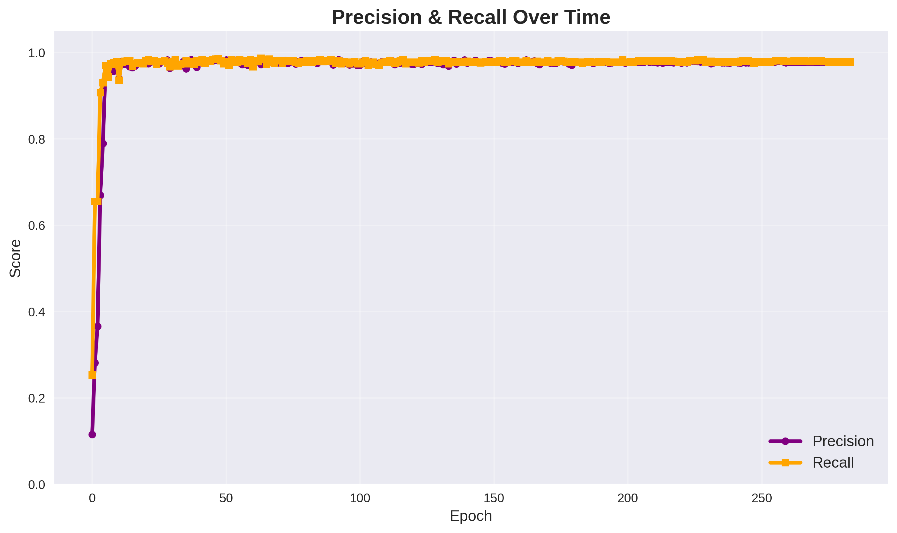
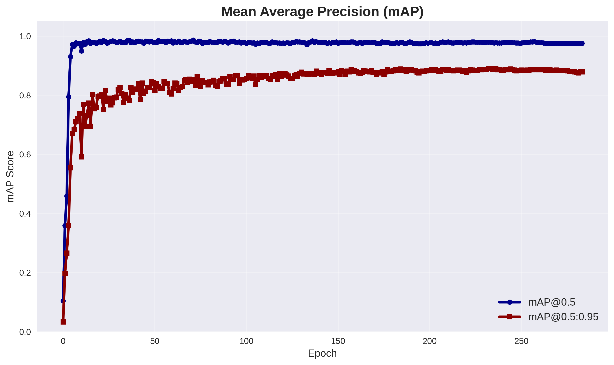

# 🚓🏇 Team-Tim 🔫

> **한 줄 소개**: 파인튜닝한 소규모 모델을 기반으로 객체를 탐지하고 제어하는 자율주행 팀 프로젝트
---
# 🪦 목차
1. [프로젝트 개요](#프로젝트-개요)
2. [주요 기능](#주요-기능)
3. [아키텍처](#아키텍처)
4. [설치 및 실행](#설치-및-실행)
5. [주행 영상](#주행-영상)
6. [데이터 및 모델](#데이터-및-모델)
7. [팀원](#팀원)
8. [라이선스](#라이선스)
---
# 👽프로젝트 개요
- **목표**: 싸우지 않기
- **스택**: 🐍Python, 🤖ROS2, 😮OpenCV, 💃YOLO, 🐋Docker
---
# 💣주요 기능
- **차선 인식**: OpenCV + Depth Map
- **객체 감지**: YOLOv5 + Fine-Tunning
---
# 🐉아키텍처
1. 센서 드라이버 (RGB 카메라, Depth 카메라)
2. 인식 노드 -> 토픽 퍼블리시
3. 제어 노드 -> 액추에이터 명령
---
# 🐁설치 및 실행
## 1) 사전 준비

## 2) 실행 방법
---
# 🎠주행 영상
---
# 🦣데이터 및 모델
## 데이터

약 2000개의 원본 라벨링 이미지 생성 후 데이터 증강으로 총 4000여 개 데이터 학습

## 🎯 모델 성능
### 학습 결과 (284 에포크)
  
|지표|최종 값|최고 값|
|:---:|:---:|:---:|
|정밀도|97.8%|98.4%|
|재현율|97.9%|98.7%|
|mAP@0.5|97.5%|98.6%|
|mAP@0.5:0.95|87.9|89.1%|
|F1 점수|97.8%|-|

### 학습 특성
✅**과적합 없음**: 훈련/검증 손실 차이 < 0.002 (건강한 학습)    
✅**뛰어난 안정성**: 마지막 20 에포크 성능 지표 표준편차 < 0.001    
✅**일관된 성능**: 학습 전체 기간 동안 97% 이상 정확도 유지    
✅**장기간 학습**: 284 에포크 동안 성능 저하 없이 성공적 학습    

### 주요 특징
🚀**거의 완벽한 탐지**: 97.5% mAP@0.5로 균형잡힌 정밀도-재현율    
📊**상용화 준비 완료**: 실제 환경 배포에 적합한 안정적 성능      
⚡**견고한 학습**: 284 에포크 장기간 학습에도 과적합 발생하지 않음    
🎯**최첨단 성능**: 87.9% mAP@0.5:0.95로 뛰어난 위치 정확도 입증    

### Analytic plots

---
## 🤡팀원
---
## 라이선스

